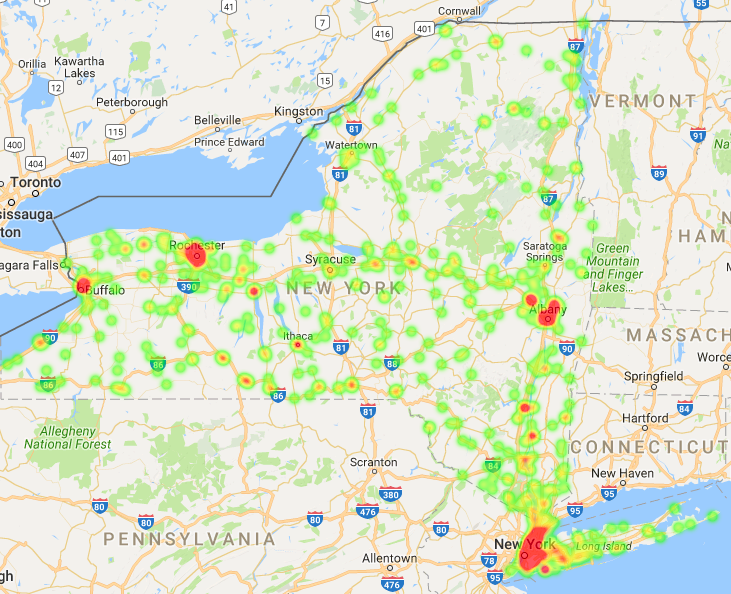

The purpose of this research topic is to find counties that have too many farmers markets, defined as 'Overpopulated Counties'. As well as counties that have too few farmers markets, defined as 'Underpopulated Counties'.

### Definitions
**Overpopulated Counties:** Counties that have a high 'People per Market' and 'Sqr Miles per Market' value.
**Underpopulated Counties:** Counties that have a low 'People per Market' and 'Sqr Miles per Market' value.

Below is an image from this research that show locations accross the state of New York that have farmers markets. The more red that spot is on the map, to more that area is saturated with markets.

Too check out more please visit the [research page](https://jstuve.github.io/FMResearch.github.io/overunder/)!

 
